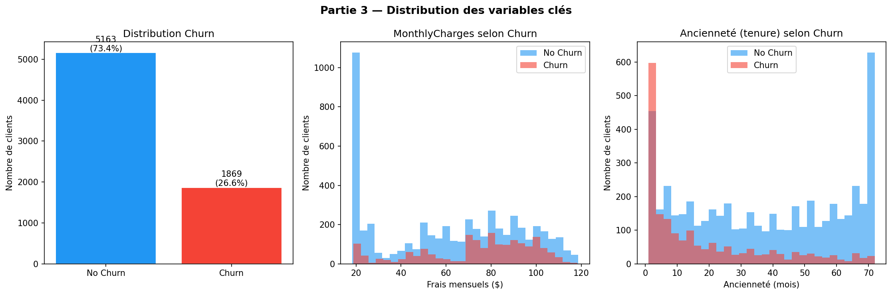
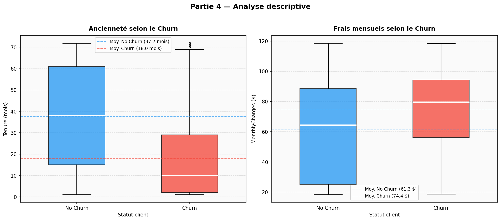
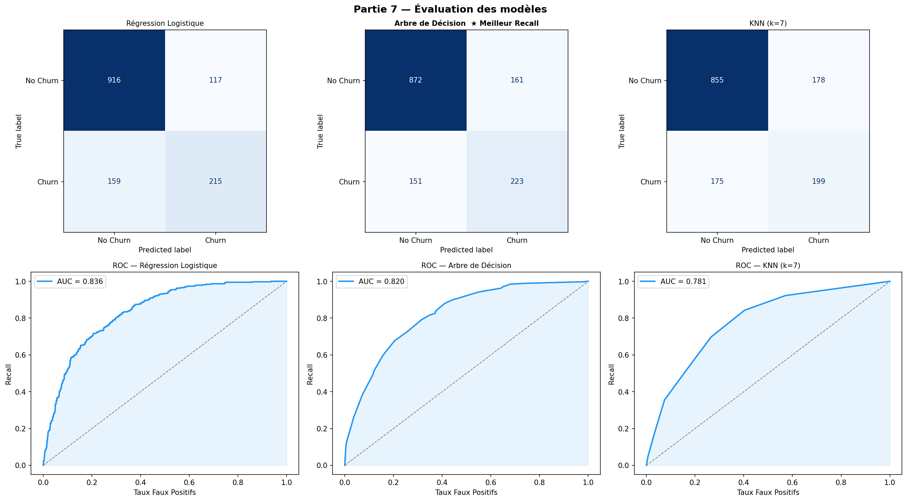
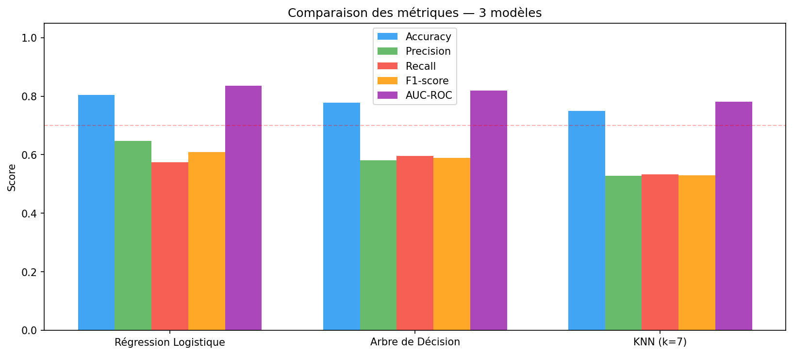
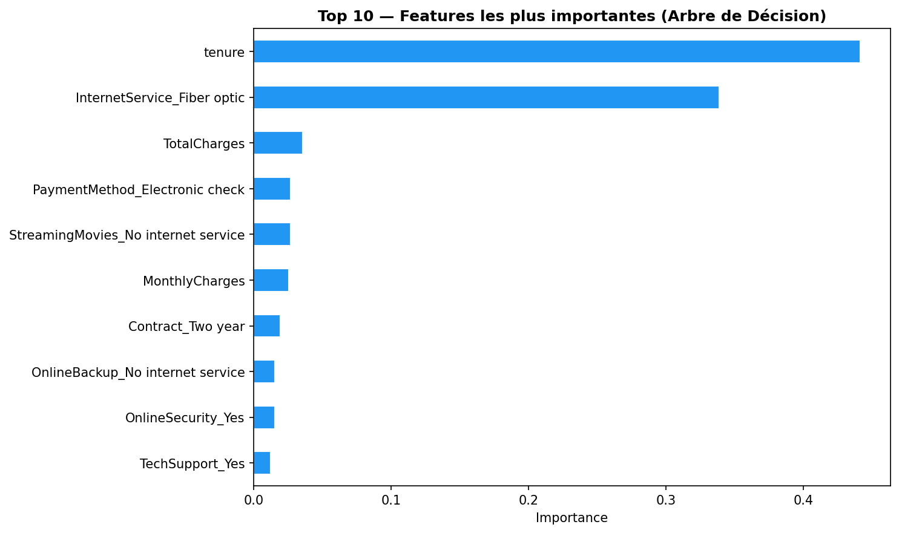

# 📡 Prédiction du Churn Client — Télécommunications
 
> Atelier N°05 · Master MD3SI · Python Avancé (M113) · Université Sultan Moulay Slimane · FP Beni Mellal

## 🎯 Contexte et objectif
 
Dans le domaine des télécommunications, la **perte de clients (churn)** représente un enjeu financier majeur. Ce projet construit un modèle prédictif capable d'identifier les clients susceptibles de quitter l'entreprise **avant qu'ils ne le fassent**, permettant des actions de rétention ciblées et proactives.
 
**Dataset** : [Telco Customer Churn — Kaggle](https://www.kaggle.com/datasets/blastchar/telco-customer-churn)  
**7 043 clients** · **21 variables** · Variable cible : `Churn` (Yes/No)  
**Déséquilibre** : 73.4% No Churn · 26.6% Churn ⚠️
 
---
## 📁 Structure du projet
 
```
atelier05-churn-prediction/
├── Atelier.py                            # Script Python principal
├
├── WA_Fn-UseC_-Telco-Customer-Churn.csv  # Dataset (à télécharger sur Kaggle)
├── P3_distributions.png                  # Distribution des variables clés
├── P4_analyse_descriptive.png            # Analyse Tenure MonthlyCharges
├── P7_evaluation.png                     # Matrices de confusion + Courbes ROC
├── P7_metriques.png                      # Comparaison des métriques
├── P8_feature_importance.png             # Top 10 features importantes
└── README.md

##  Parties du projet
 
| Partie | Contenu |
|--------|---------|
| **P1 — Exploration** | Dimensions (7032 × 21), types, valeurs manquantes |
| **P2 — Nettoyage** | Conversion TotalCharges, encodage catégorielles (LabelEncoder + get_dummies) |
| **P3 — Compréhension** | Statistiques descriptives, distribution Churn déséquilibrée (73.4% / 26.6%) |
| **P4 — Analyse** | Tenure moy. churners = 18 mois vs restés = 37.7 mois · Charges 74.4$ vs 61.3$ |
| **P5 — Modélisation** | Régression Logistique · Arbre de Décision · KNN (k=7) |
| **P7 — Évaluation** | Accuracy · Precision · Recall · F1-score · AUC-ROC |
| **P8 — Métier** | Facteurs de churn, profils à risque, actions de rétention, déploiement |
 
---
 
##  Résultats réels obtenus
 
| Modèle | Accuracy | Recall (Churn) | F1-score | AUC-ROC |
|--------|:--------:|:--------------:|:--------:|:-------:|
| Régression Logistique | **80%** | 57.49% | 0.61 | **0.836** |
| **Arbre de Décision** ⭐ | 78% | **59.63%** | 0.59 | 0.820 |
| KNN (k=7) | 75% | 53.21% | 0.53 | 0.781 |
 
> ⭐ **Meilleur modèle selon le Recall : Arbre de Décision (59.63%)**  
> Le Recall est la métrique prioritaire — manquer un churner coûte plus cher que cibler un client fidèle.  
> La Régression Logistique reste supérieure en AUC-ROC (0.836) et Accuracy (80%).
 
---
 
##  Visualisations
 
**Distribution des variables clés (P3)**

 
**Analyse descriptive — Tenure & MonthlyCharges (P4)**

 
**Évaluation des modèles — Confusion Matrix & ROC (P7)**

 
**Comparaison des métriques (P7)**

 
**Top 10 Features importantes — Arbre de Décision (P8)**

 
---
 
##  Principaux facteurs de churn identifiés
 
D'après la **feature importance de l'Arbre de Décision** :
 
1. **tenure** (importance ≈ 0.46) → les clients récents partent beaucoup plus
2. **InternetService_Fiber optic** (≈ 0.34) → clientèle sensible aux offres concurrentes
3. **TotalCharges** (≈ 0.04) → corrélé à l'ancienneté
4. **PaymentMethod_Electronic check** → mode de paiement associé au churn
5. **MonthlyCharges** → frais élevés augmentent le risque
 
---
 
## Profils clients les plus à risque
 
| Profil | Caractéristiques | Risque estimé |
|--------|-----------------|:-------------:|
| 🔴 Très risqué | Contrat mensuel · tenure < 12 mois · Fibre optique | > 55% |
| 🟠 Risqué | Senior · Sans partenaire · MonthlyCharges > 70$ | 40–55% |
| 🟢 Fidèle | Contrat 2 ans · tenure > 36 mois · Avec partenaire | < 10% |
 
---
 
##  Actions de rétention proposées
 
-  **Migrer vers contrats longs** → réduction -15% sur contrat annuel ou -25% sur 2 ans
-  **Bonus fidélité** lors des 6 premiers mois (période la plus critique)
-  **Alerte proactive** si P(churn) > 60% → appel commercial sous 48h
-  **Support dédié seniors** → ligne prioritaire et interface simplifiée
-  **Scoring mensuel automatique** de chaque client dans le CRM
 
---
 
##  Solution améliorée proposée
 
Les 3 modèles de l'atelier atteignent un Recall de 53–60%, insuffisant pour un déploiement en production. La solution recommandée :
 
```
Random Forest + SMOTE + Seuil optimisé (0.40)
→ Recall estimé : 72–75%
→ Détection de ~280 churners sur 374 (vs 223 actuellement)
```
 
---
 
##  Installation et utilisation
 
```bash
 
# Installer les dépendances
pip install pandas numpy matplotlib seaborn scikit-learn
 
# Télécharger le dataset depuis Kaggle :
# https://www.kaggle.com/datasets/blastchar/telco-customer-churn
# Placer WA_Fn-UseC_-Telco-Customer-Churn.csv dans le dossier
 
# Lancer le script
python Atelier.py
```
 
---
 
## 🛠️ Stack technique
 
| Outil | Usage |
|-------|-------|
| `pandas` / `numpy` | Manipulation et nettoyage des données |
| `matplotlib` / `seaborn` | Visualisations |
| `scikit-learn` | Modèles ML · métriques · prétraitement |
 
---
 
## 📄 Livrables
 
- [x] Script Python complet et commenté (`Atelier.py`)
- [x] 5 visualisations exportées (PNG)
- [x] Sélection automatique du meilleur modèle selon le Recall
- [x] Solution améliorée proposée : Random Forest + SMOTE + seuil optimisé
 
---
 
## 👤 Auteur 
- 🔗 LinkedIn : [linkedin.com/in/aboubaker-oukim](https://ma.linkedin.com/in/aboubaker-oukim-2a052b22b)
 
---